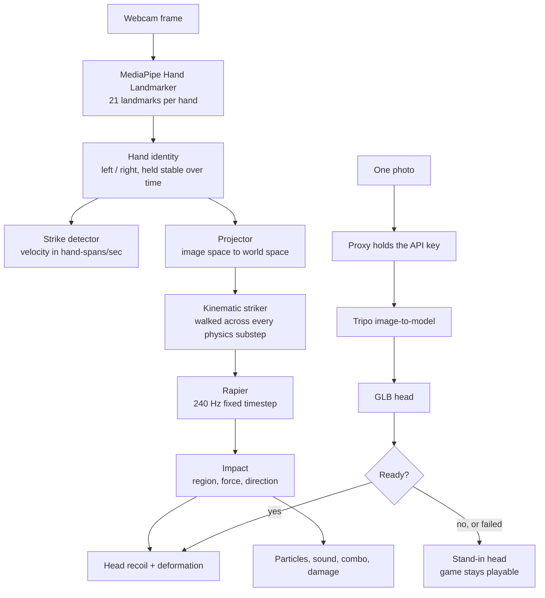

# Face Smash 🥊


## Basic Details
### Team Name: FUSE


### Team Members
- Team Lead: Sufiyan Shiraj Mohammed - Adi Shankara Institute of Engineering and Technology
- Member 2: Tejas KM - Adi Shankara Institute of Engineering and Technology

### Project Description

Face Smash is a browser-based gesture-controlled 3D game that turns your face
into a physically interactive punching target.

Scan your face, generate a 3D version of your head, stand in front of your
webcam, and punch the air.

Your hand becomes the controller.

The webcam becomes the sensor.

Your face becomes the punching bag.

And somehow, all of this happens inside a browser.

There are no buttons to press, no controller to hold, and no reason to take
this as seriously as we did.

### The Problem (that doesn't exist)

Have you ever wanted to punch yourself?

Probably not.

But if you did, you would immediately run into a surprisingly complicated
engineering problem.

You cannot safely punch your physical face without also experiencing the
punch.

You could punch a mirror, but then the mirror gets involved.

You could punch a photograph, but photographs have historically shown very
little interest in physics.

You could punch a screen, but your laptop's warranty department would probably
have opinions.

So we asked a much more important question:

**What if you could punch a digital version of yourself, and the computer
could actually understand how you punched it?**

That sounds like a useless question.

It turns out answering it requires solving several very real problems:

- How do you understand a punch using only a webcam?
- How do you distinguish a punch from someone simply moving their hand?
- How do you estimate the direction and intensity of that motion?
- How do you turn a photograph into a usable 3D representation?
- How do you make a 3D face physically react to an impact?
- And how do you do all of this without sending someone's face and camera
  feed to a server?

We decided to find out.

### The Solution (that nobody asked for)

Face Smash turns the user's webcam into a motion controller.

The user first uploads or scans their face to create a 3D head. Once inside
the Smash Lab, real-time hand tracking observes the user's hand and extracts
its movement through space.

When the system detects a punch-like trajectory, it calculates the movement's
direction, velocity, and impact characteristics.

That impact is then translated into the virtual world.

The 3D face moves.

The face deforms.

Particles explode.

The damage counter increases.

The combo multiplier goes up.

And somewhere along the way, a perfectly ordinary webcam has become a
violence-powered input device.

The interesting part is that the underlying technology is not limited to
punching. The same pipeline can be used for gesture-controlled interfaces,
touchless game controls, interactive 3D environments, motion-based
simulations, and real-time browser-based computer vision.

We simply chose to use it for the most scientifically questionable
application we could think of.

**Your face goes into the system.**

**Your webcam stays on your machine.**

**Your dignity is unfortunately not part of the privacy model.**

## Technical Details
### Technologies/Components Used
For Software:
- **Languages:** JavaScript (ES modules), GLSL
- **Frameworks:** Three.js + React Three Fiber, Vite, React Router
- **Libraries:** MediaPipe Tasks Vision (hand + face landmarking), Rapier (physics)
- **Services:** Tripo (single photo → 3D head reconstruction)
- **Tools:** Blender (retopology / rig cleanup)

Every real-time system runs locally in the browser: hand tracking, face
landmarking, strike detection, physics, and rendering. **The webcam feed never
leaves your machine and is never uploaded anywhere.**

The one exception is 3D reconstruction. Turning a photo into a head is done by
Tripo, which means exactly one still image is uploaded, once, when you ask for
it — and a small proxy runs alongside the dev server to hold the API key. The
key cannot live in the browser, because anything shipped to the client is
readable by anyone who opens devtools, and this key has billing attached.

For Hardware:

This is a software-only project. It needs no custom hardware, no circuit, and
nothing to assemble — the "controller" is your hand.

- **Webcam:** any laptop or USB webcam
- **Computer:** a modern laptop capable of running WebGL2
- **Controller:** the user's hand
- **Display:** laptop / desktop screen
- **Internet:** required only for the one-time 3D reconstruction
- **Tools required:** a browser and at least one questionable decision

### Implementation
For Software:

# Installation

```bash
npm install
```

`postinstall` copies MediaPipe's wasm out of `node_modules` and downloads the
`.task` models into `public/`. Everything the app needs at runtime is served
from disk — it does not touch a CDN, because venue wifi cannot be trusted.
To redo that step by hand:

```bash
npm run assets
```

3D head generation needs a Tripo API key. Create `.env.local` in the project
root:

```bash
TRIPO_API_KEY=tsk_your_key_here
```

Note the **missing `VITE_` prefix — that is deliberate.** Vite only exposes
variables that start with `VITE_` to the browser, so leaving it off is what
keeps the key server-side. It is read by the dev server and used only by the
proxy in `src/server/tripoProxy.js`.

The key also needs credit on it. Without credit, Tripo returns
`You don't have enough credit to create this task` and the game falls back to
the stand-in head — everything else still works.

# Run

```bash
npm run dev
```

Then open the printed URL and allow camera access. Chrome only allows webcams
on `localhost` or HTTPS.

The game never blocks on 3D generation. Upload a photo and the Smash Lab opens
immediately with a stand-in head; your real head swaps in when it is ready, and
if it fails you simply keep punching the stand-in.

**Headless test suites.** Every part of the pipeline that is hard to debug by
looking at the screen has a harness, so it can be checked without a camera:

```bash
npm run sim           # strike detector — synthetic slap trajectories
npm run sim:physics   # impacts, neck spring, weapon colliders
npm run sim:capture   # photo angle collection
npm run sim:mapping   # hand → world projection and arm IK
npm run sim:tracking  # left/right hand identity and velocity gating
```

### Project Documentation
For Software:

# Screenshots (Add at least 3)


*The upload screen — drop in one photo of your face and it is cropped, scored
and queued for 3D reconstruction.*


*The Smash Lab mid-punch — tracked hands driving gloves in world space, with
the damage, hits and combo readout live on the right.*


*An impact landing — face deformation, particles and the comic hit frame that
fires on contact.*

# Diagrams


*End-to-end flow, from webcam frame to physical impact.*



For Hardware:

Not applicable — Face Smash is a software-only project with no circuit, no
schematic and nothing to build. The only "component" is a webcam you already
own.

# Schematic & Circuit

*No circuit — software-only project.*

# Build Photos

*No physical build — software-only project.*

### Project Demo
# Video
[Add your demo video link here]
*A full run: uploading a photo, the head being generated, and a live punching
session with hand tracking driving the impacts.*

# Additional Demos
[Add any extra demo materials/links]

## Team Contributions
- Sufiyan Shiraj Mohammed: [Add specific contributions]
- Tejas KM: [Add specific contributions]

---
Made with ❤️ at TinkerHub Useless Projects 


